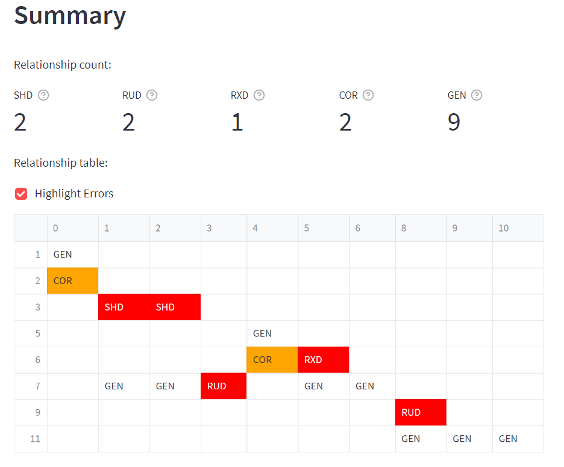

# Firewall Policy Analyzer

A application module that detects anomalies and conflicts in firewall policies.

[](https://martimy-firewall-policy-analyzer-st-analyzer-ust3ul.streamlit.app/)



## Installation:

To use the app, follow these steps (assuming Ubuntu Linux, but Windows also works):

1. Clone this repository:

```bash
$ git clone https://github.com/martimy/firewall_policy_analyzer
$ cd firewall_policy_analyzer
```

2. Install Streamlit and other requirements

```bash
$ pip3 install -r requirements.txt
```

3. Start the Streamlit app

```bash
$ streamlit run st_analyzer.py
```

## Getting Started

This app analyzes firewall rules saved  as a .csv file in the following format:

```csv
protocol,src,s_port,dest,d_port,action
TCP,192.168.1.1,ANY,172.16.16.1,80,ACCEPT
TCP,192.168.1.3,ANY,172.16.16.1,80,ACCEPT
...
```

where:

- protocol: is a TCP/IP protocol
- src/dest: is the source/destination IPv4 addresses
- s_port/d_port: is the source/destination port numbers
- action: either ACCEPT or DENY

1. Upload the rules .csv file.

    Once the file is uploaded successfully, you can view the file content by expanding the "See Rules" widget.


2. The numbers and types of all discovered anomalies will by shown below the Summary heading. The Relationship table shows all anomalies between the X rules (columns) and Y rules (rows), where X and Y are the rule number (starting from 0).   


3. Under Analysis heading, select the rules that are part of any anomaly relationship using the left and right select boxes for Rule Y and Rule X, respectively. The type of anomaly and the affected rules' numbers will be displayed under a copy of the rules. You can also expand the Definition widget to get learn about the anomaly.  


4. Under the Recommendation heading, the analyzer shows the recommended action to take. If you choose to apply the recommendation, the analyzer will modify the original rule set accordingly (this action cannot be undone).

   Note that for the change to take affect, you must check the box "Use edited rules" under the rules file name (near the top of the screen).

5. Repeat steps 3 and 4 for other anomalies until all anomalies are corrected. Note that the analyzer does not provide to apply recommendations for correlation anomalies so the user must modify the original file manually if required.

6. Once you are satisfied with all the changes, you can save the modified rule set by clicking the "Download rules" button under the Rules widget. The new rules will be saved as "new_rules.csv" in the default Downloads folder.


## Acknowledgements:

The code is based on the following research:

[1] E. Al-Shaer, H. Hamed, R. Boutaba, and M. Hasan, “Conflict classification and analysis of distributed firewall policies,” IEEE J. Select. Areas Commun., vol. 23, no. 10, pp. 2069–2084, Oct. 2005.  
[2] E. S. Al-Shaer and H. H. Hamed, “Modeling and Management of Firewall Policies,” IEEE Trans. Netw. Serv. Manage., vol. 1, no. 1, pp. 2–10, Apr. 2004.
