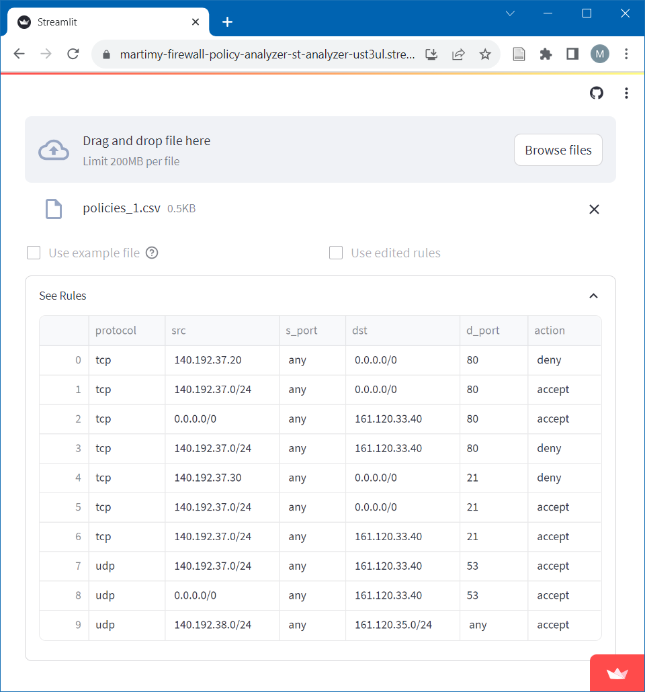
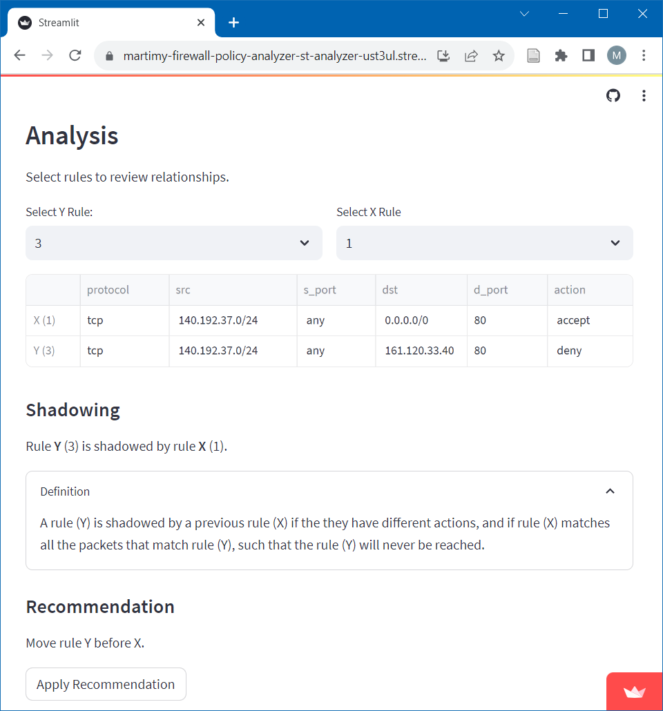
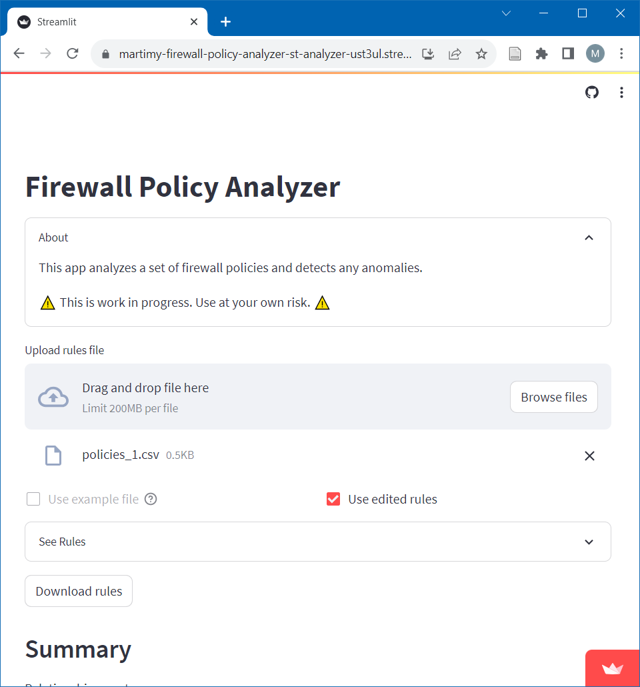

# Firewall Policy Analyzer

The app is written in Streamlit: [](https://martimy-firewall-policy-analyzer-st-analyzer-ust3ul.streamlit.app/)

This is an application that detects patterns and conflicts in firewall policies. The app aims to improve the security and performance of network firewalls by identifying and resolving policy inconsistencies. The app uses a formal model to represent firewall rules and a conflict detection algorithm to find policy conflicts. The app also provides a graphical user interface to visualize and manage firewall policies.

## Summary of changes in v0.2

- Handling of an optional policy field "interface".
- A source port is no longer a mandatory field in the rules.
- A source/destination port can include one or more port numbers, ranges, and/or valid port names (e.g. HTTP).
- Action field can include: "permit", "allow", "accept", "pass", "deny", "reject", or "drop". 
- General code improvements.

## Limitations

- Firewall rules that have overlapping sets of ports will not be handled properly. For example, 
the app will not report the shadwing error related to HTTP in these two rules.

    protocol | src | dst | d_port | action
    ---|---|---|---|---
    tcp | 140.192.37.0/24 | 0.0.0.0/0 | HTTP, HTTPS | accept
    tcp | 140.192.37.0/24 | 161.120.33.40 | HTTP, DNS | deny


## Installation:

To use the app, follow these steps (assuming Ubuntu Linux, but Windows also works):

1. Clone this repository:

```bash
$ git clone https://github.com/martimy/firewall_policy_analyzer
$ cd firewall_policy_analyzer
```

2. Install Streamlit and other requirements

```bash
$ pip3 install -r requirements.txt
```

3. Start the Streamlit app

```bash
$ streamlit run st_analyzer.py
```

## Getting Started

[Watch the Getting Started video on YouTube](https://youtu.be/zJFOc2t0GhI).

This app analyzes firewall rules saved  as a .csv file in the following format:

```csv
protocol,src,s_port,dest,d_port,action
TCP,192.168.1.1,ANY,172.16.16.1,80,ACCEPT
TCP,192.168.1.3,ANY,172.16.16.1,80,ACCEPT
...
```

where:

- protocol: is one of the following: 'IP', 'ICMP', 'TCP', or 'UDP'.
- src/dest: is the source/destination IPv4 addresses. Acceptable formats are: 'x.x.x.x' for hosts, 'x.x.x.x/x' for networks, '0.0.0.0/0', or 'ANY'.
- s_port/d_port: is the source/destination port numbers or 'ANY'.
- action: either 'ACCEPT' or 'DENY'.

1. Upload the rules .csv file.

    Once the file is uploaded successfully, you can view the file content by expanding the "See Rules" widget.



2. The numbers and types of all discovered patterns will by shown below the Summary heading. The Relationship table shows all patterns between the X rules (columns) and Y rules (rows), where X and Y are the rule number (starting from 0).   


3. Under Analysis heading, select the rules that are part of any anomaly relationship using the left and right select boxes for Rule Y and Rule X, respectively. The type of anomaly and the affected rules' numbers will be displayed under a copy of the rules. You can also expand the Definition widget to get learn about the anomaly.  



4. Under the Recommendation heading, the analyzer shows the recommended action to take. If you choose to apply the recommendation, the analyzer will modify the original rule set accordingly (this action cannot be undone).

   Note that for the change to take affect, you must check the box "Use edited rules" under the rules filename (near the top of the screen).

5. Repeat steps 3 and 4 for other patterns until all patterns are reviewed. Note that the analyzer does not provide the option to apply recommendations for correlation patterns so the user must modify the original file manually, if needed.

6. Once you are satisfied with all the changes, you can save the modified rule set by clicking the "Download rules" button under the Rules widget. The new rules will be saved as "new_rules.csv" in the default Downloads folder.



## Acknowledgements:

The code is based on the following research:

[1] E. Al-Shaer, H. Hamed, R. Boutaba, and M. Hasan, “Conflict classification and analysis of distributed firewall policies,” IEEE J. Select. Areas Commun., vol. 23, no. 10, pp. 2069–2084, Oct. 2005.  
[2] E. S. Al-Shaer and H. H. Hamed, “Modeling and Management of Firewall Policies,” IEEE Trans. Netw. Serv. Manage., vol. 1, no. 1, pp. 2–10, Apr. 2004.
